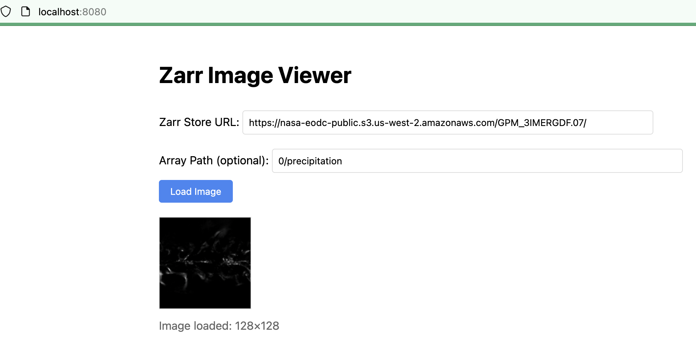

# Zarr Viewer

Testing out client-side visualization of Zarr data.

## Usage

```
npm install
npm start
```

## Example data:

Store URL: https://nasa-eodc-public.s3.us-west-2.amazonaws.com/GPM_3IMERGDF.07/
Array path: 0/precipitation


